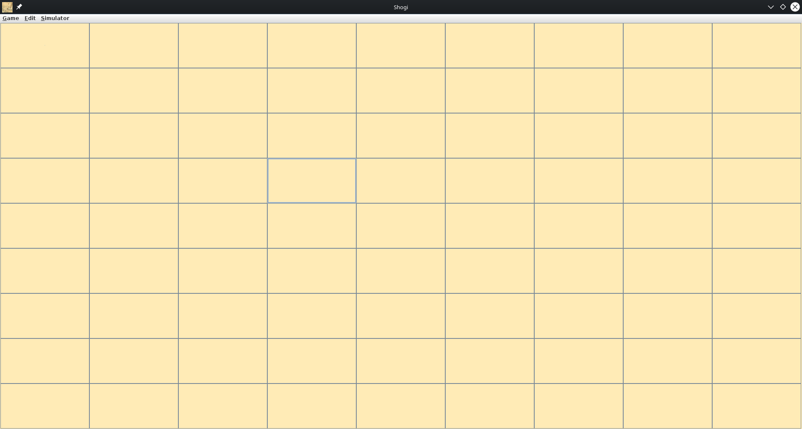
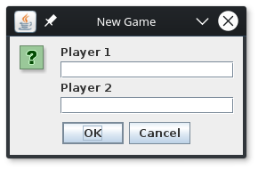
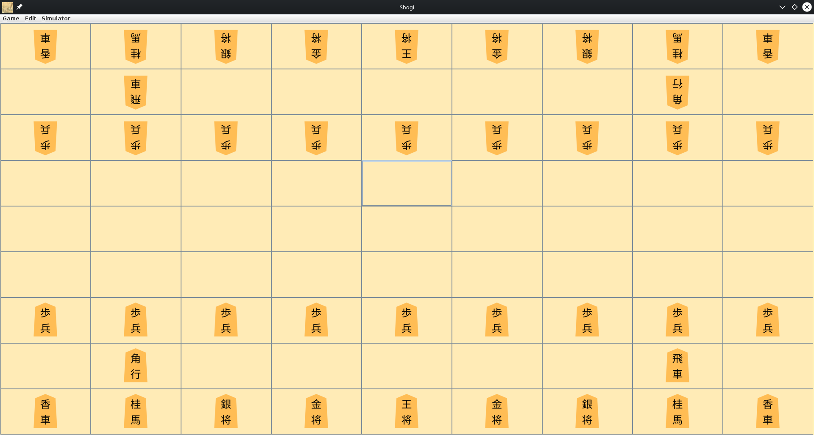

1. [Zweck des Projekts](#zweck-des-projekts)
2. [Der Kunde und andere Stakeholder](#der-kunde-und-andere-stakeholder)
3. [Benutzer des Produkts](#benutzer-des-produkts)
4. [Mandat Einschränkungen](#mandat-einschränkungen)
5. [Benennungskonventionen und Definitionen](#benennungskonventionen-und-definitionen)
6. [Relevante Fakten und Annahmen](#relevante-fakten-und-annahmen)
7. [Der Umfang des Werkes](#der-umfang-des-werkes)
8. [Der Umfang des Produkts](#der-umfang-des-produkts)
9. [Funktions- und Datenanforderungen](#funktions--und-datenanforderungen)
    - 9.1 [Projektanforderung](#projektanforderung)
    - 9.2 [Produktanforderung](#produktanforderung)
10. [Look-and-Feel-Anforderungen](#look-and-feel-anforderungen)
11. [Bedienbarkeit und Menschnliche Anforderungen](#bedienbarkeit-und-menschnliche-anforderungen)
12. [Leistungsanforderungen](#leistungsanforderungen)
13. [Betriebs- und Umweltanforderungen](#betriebs--und-umweltanforderungen)
14. [Anforderungen an die Wartbarkeit und den Support](#anforderungen-an-die-wartbarkeit-und-den-support)
15. [Sicherheitsanforderungen](#sicherheitsanforderungen)
16. [Kulturelle und politische Anforderungen](#kulturelle-und-politische-anforderungen)
17. [Gesetzliche Anforderungen](#gesetzliche-anforderungen)
18. [Offene Fragen](#offene-fragen)
19. [Off-the-Shelf Solutions](#off-the-shelf-solutions)
20. [Neue Probleme](#neue-probleme)
21. [Aufgaben](#aufgaben)
22. [Migration auf das neue Produkt](#migration-auf-das-neue-produkt)
23. [Risiken](#risiken)
24. [Kosten](#kosten)
25. [Benutzerdokumentation und Schulung](#benutzerdokumentation-und-schulung)
    - 25.1 [Spielregeln](#spielregeln)
    - 25.2 [Erklärung der UI](#erklärung-der-ui)
26. [Wartezimmer](#wartezimmer)


# Zweck des Projekts

Dieses Projekt wird im Umfang des Studiums der Htwg-Konstanz im Fach Software Technik durchgeführt.
In diesem Projekt sollen Studenten folgende Kenntnisse erlangen:
	- Erlernen der Sprache in [Scala](https://www.scala-lang.org/)
	- Software Architektur Modelle (Hier MVC)
	- Test getriebene Softwareentwickung
	- Skalierbarkeit der Software
	- Verbesserung der Software durch Verwendung von Patterns
	- Dependency Injektion
	- Korrekte Abhaängikeiten zwischen den Schichten des Modells
	- Benutzung des Version Controll Tools [Git](https://github.com/)
	- Benutzen des Online Build Tools [Travis](https://travis-ci.org/)
	- Benutzen des Code Coverage Tools [Coveralls](https://coveralls.io/)
	- Arbeiten mit [Scrumwise](https://www.scrumwise.com/)
	- Speichern mit XML und Json
	- Korrekte Projekt Dokumentation

# Der Kunde und andere Stakeholder

Dieses Projekt steht ihnen kostenlos zur Verfügung.

Geeignet für jeden Interresenten an dem Japanischen Strategiespiel Shogi.

# Benutzer des Produkts

Dieses Produkt richtet sich an alle Shogispieler und Shogiinterressenten

# Mandat Einschränkungen

Die Einschränkungen umfassen folgende Punkte:
	- Kontroller- und Modellschicht müssen eine 100%ige Codeabdekkung besitzen
	- Es muss min. 3 Pattern beinhalten
	- Abhängigkeiten müssen durch Component Pattern und Dependency Injection aufgelöst werden
	- Speichern und Laden Funktionen müssen Implementiert werden
	- Das Projekt soll in Scala geschrieben werden
	- Einbauen eines Loggers
	- Folgende Prinizipien der Softwareentwicklung sollten eingehalten werden (SOLID)
		- Single Responsibility Principle (SRP)
		- Open-Closed Principle (OCP)
		- Liskov Substitution Principle (LSP)
		- Interface Segregation Principle (ISP)
		- Dependency Inversion Principle (DIP)

# Benennungskonventionen und Definitionen

Die Paketstruktur und Namengebung sollte wie Folgt aussehen:

```text
de.htwg.se.ShoShogi
            |
            |---aview
            |
            |---controller
            |
            |---model
            |
            |---util
```

Der Sinn dahinter ist, dass die Anordnung der Pakete dem Schichtenmodell gleicht.
Dadurch wird das Verständnis unseres Schichten-Modells vereinfacht (MVC).

Jedwede Benennung von Parametern, Variablen und Funktionen sollten in einer  gut verständlichen  und gut lesbaren Art verfasst werden, welche eine zusätzliche Erklärung des Quellcode durch einen Kommentar überflüssig machen.

# Der Umfang des Werkes

Dieses Projekt wurde im Zeitraum vom 6. Oktober 2017 bis 26. Januar 2018 in einem 2er Team umgesetzt.
Über diesem Zeitraum wurde es ständig weiter entwickelt und verbessert.
Um eine Agile-Entwicklung zu gewährleisten wurde [Scrumwise](https://www.scrumwise.com/) verwendet. In den einzelnen Sprints die für jeweils eine WOche angelegt waren, wurden die User-Storys von beiden Teampartnern festegelegt.

Wöchentlicher Zeitaufwand betrug ca. 10h.

# Der Umfang des Produkts

Das Prudukt beinhaltet ein komplettes Spiel bestehend aus einem Spielbrett und Japanischen Shogifiguren.

#Funktions- und Datenanforderungen

## Projektanforderung

Zum ausführen des Projektes empfehlen wir [IDEA](#https://www.jetbrains.com/idea/) von JetBrains.
Zusätzlich werden folgende Dependencys benötigt:
	- Scala (min. Version 2.11.8)
	- Junit (min. Version 4.8)
	- Scala-swing (min. Version 2.11.0)
	- Google-inject (min. Version 3.0)
	- Scala-Guice (min. Version 4.1.0)
	- Play-Json (min. Version 2.6.6)
	- Logback-classic (min. Version 1.2.3)
	- Scala-logging (min. Version 3.7.2)

Für genauers siehe [Build.sbt](./build.sbt)

## Produktanforderung

Um das Endprodukt ausführen zu können wird lediglich eine JRE oder JDK benötigt (min. Version 8). (Bspw.: [JRE-Oracle](http://www.oracle.com/technetwork/java/javase/downloads/jre8-downloads-2133155.html), [JDK-Oracle](http://www.oracle.com/technetwork/java/javase/downloads/jdk8-downloads-2133151.html))

# "Look and Feel" Anforderungen

Angelehnt wurde das Produkt an das echte Shogispiel und vermittelt die nötigsten Inhalte.

# Bedienbarkeit und Menschnliche Anforderungen

Das Ziel war es die Bedienung des Spiels so intuitiv wie möglich zu gestalten. Dies haben wir durch eine leicht zu benutzende Oberfläche erreicht.

Zum spielen wird von dem Benutzer lediglich Interresse und die Kompetenz zur Benutzung eines Computers erfordert.

(☞ﾟヮﾟ)☞

# Leistungsanforderungen

Dieses Produkt sollte auf den meisten heutzutage erhaltbaren Geräten laufen.

# Betriebs- und Umweltanforderungen

Es bestehen keine Betriebs- und Umweltanforderungen.

# Anforderungen an die Wartbarkeit und den Support

Die Wartbarkeit wurde durch Skalierbarkeit des Programms erfüllt.
Support wird nicht angeboten, da es sich hier um ein Projekt im Studium handelt

# Sicherheitsanforderungen

Sicherheitsanforderungen wurden hier nicht genauer behandelt. Dies wird im späteren Verlauf des Studium behandelt.

# Kulturelle und politische Anforderungen

Dieses Produkt wurde von Studenten ohne Japanischkenntnissen entwickelt. Sollten sich Kulturelle Fehler im Produkt befinden, so würden wir uns über ein Issue freuen.

# Gesetzliche Anforderungen

# Offene Fragen

# Off-the-Shelf Solutions

# Neue Probleme

# Aufgaben

# Migration auf das neue Produkt

Das Produkt muss bei updates neu Heruntergeladen werden.

# Risiken

(Achtung nicht ernst gemeint!)
Hoher Spaß- und Suchtfaktor (☞ﾟヮﾟ)☞.

# Kosten

Kostenfrei.

# Benutzerdokumentation und Schulung

## Spielregeln

Die Spielregeln wurden der Seite [www.ancientchess.com](http://ancientchess.com/page/play-shogi.htm) entnommen.

## Erklärung der UI

Das folgende Bild zeigt ein leeres Spielfeld bevor ein neues Spiel gestartet worden ist. Unter dem Menüpunkt Game kann ein neues Spiel gestartet werden.



In dem darauf aufgehenden Pop-Up Fenster können die Namen der Spieler eingetragen werden. Falls das Feld leer gelassen wird, wird dem Spieler automatisch der Name "Player 1" oder "Player 2" zugewiesen.



Nach bestätigung wird das Board mit den Spielfiguren gefüllt.



Spieler 1 fängt an indem er eine Figur per Mausklick auswählt und auf ein markiertes Feld danach klickt. Dadurch wandert die Figur auf das ausgewählte Feld. Nach dem Selben Prinzip können eroberte Spielsteine wieeder aufs Board gesetzt werden.

Unter dem Menüpunkt Game kann zudem das Spiel gespeichert oder eine gespeichertes Spiel wieder geladen werden.

Falls Sie mit dem gespielten Spielzug nicht zufrieden sind, haben Sie die Möglichkeit unter dem Menüpunkt Edit den Zug Rückgänig zu machen (undo). Per "redo" kann der undo wieder rückgängig gemacht werden.

Der Menüpunkt Simulator startet eine kurze Simulation welches ein Spiel nachahmt. Während diese Simulation läuft wird geraten kein Spielzug zu tätigen.

Das spiel kann entweder mit dem X des Fensters oder unter dem Menüpunkt Game per quit beendet werden. Nicht gespeicherte Spielstände gehen dabei Verloren!

# Wartezimmer